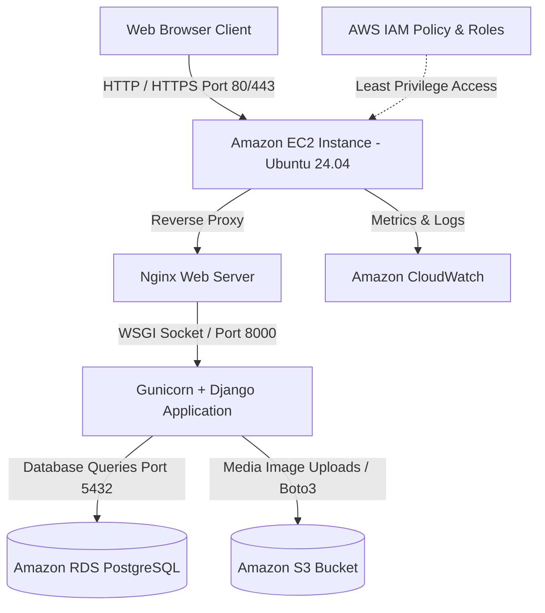

# 🧭 CampusFind: A Cloud-Based Campus Lost & Found System

> **CSBC 252: Introduction to Cloud Computing — Semester Capstone Project**  
> *A production-ready, cloud-native web application built with Django, Bootstrap, and Amazon Web Services (AWS Free Tier: EC2, RDS, S3, IAM, CloudWatch).*

---

## 🌟 Key Features

- **Centralized Campus Listings:** Public catalog of lost, found, and reunited items across campus buildings.
- **Multi-Attribute Search & Filters:** Search by title, description, keywords, category, status (Lost/Found/Claimed), campus location, and date.
- **Secure Image Uploads with Amazon S3:** Upload item photos directly to Amazon S3 storage with automatic local fallback for offline development.
- **Relational Cloud Database with Amazon RDS:** Scalable user profiles and item records hosted on Amazon RDS (PostgreSQL/MySQL).
- **Owner & Moderator Dashboards:** Posters can edit, delete, or mark items as Claimed/Reunited; Staff have full oversight via custom dashboards and Django Admin.
- **Printable Bulletin Notice Flyers:** One-click printable notice posters with tear-off contact strips for campus notice boards.
- **Automated Health Monitoring:** `/health/` JSON endpoint designed for AWS EC2, Application Load Balancers, and CloudWatch alarms.

---

## 🏗️ AWS Cloud Architecture



---

## 🚀 Quickstart Guide (Local Development)

### 1. Clone & Set Up Environment
```bash
# Clone the repository
git clone https://github.com/your-username/campusfind.git
cd campusfind

# Create and activate Python virtual environment
python3 -m venv venv
source venv/bin/activate   # On Windows: venv\Scripts\activate

# Install dependencies
pip install -r requirements.txt
```

### 2. Configure Environment Variables
Copy the sample environment file:
```bash
cp .env.example .env
```
*(By default, `.env` is configured to use SQLite and local media storage for zero-config offline execution).*

### 3. Run Migrations & Seed Demonstration Data
```bash
# Run database migrations
python manage.py migrate

# Collect static files
python manage.py collectstatic --noinput

# Populate sample campus data and demo users
python manage.py seed_data
```

### 4. Run the Development Server
```bash
python manage.py runserver
```
Visit **http://127.0.0.1:8000** in your browser!

---

## 🔑 Demo Test Accounts

The `seed_data` management command creates the following ready-to-test credentials:

| Role | Username | Password | Purpose |
| :--- | :--- | :--- | :--- |
| **Admin / Staff** | `admin` | `campus2026!` | Full admin access (`/admin/` and `/moderator/`) |
| **Student User 1** | `student_alex` | `campus2026!` | Standard student reporting & claiming |
| **Student User 2** | `student_maya` | `campus2026!` | Standard student reporting & claiming |
| **Student User 3** | `student_kwame` | `campus2026!` | Standard student reporting & claiming |

---

## 🧪 Running Automated Tests

Run the complete test suite (models, views, permissions, search, health checks):
```bash
python manage.py test
```

---

## ☁️ AWS Cloud Deployment (Production)

An automated deployment script is provided for Ubuntu EC2 instances.

1. **Launch EC2 Ubuntu 24.04 instance** with Security Group allowing ports 22, 80, 443.
2. **Launch Amazon RDS PostgreSQL instance** with Security Group allowing port 5432 from EC2 SG.
3. **Create Amazon S3 bucket** and configure IAM credentials from [`deploy/iam_policy.json`](file:///home/oxcyron/Desktop/capstone/deploy/iam_policy.json).
4. **SSH into EC2 and run:**
```bash
git clone https://github.com/your-username/campusfind.git /home/ubuntu/campusfind
cd /home/ubuntu/campusfind
chmod +x deploy/ec2_setup.sh
./deploy/ec2_setup.sh
```
5. Update `/home/ubuntu/campusfind/.env` with your Amazon RDS and S3 credentials, then restart services:
```bash
sudo systemctl restart gunicorn
sudo systemctl restart nginx
```

---

## 📂 Project Structure

```text
capstone/
├── campusfind/                # Django project root configuration
│   ├── settings.py            # S3, RDS, WhiteNoise, Auth settings
│   ├── urls.py                # Main URL routing & admin branding
│   ├── wsgi.py / asgi.py      # WSGI / ASGI entrypoints
├── core/                      # Main campus application
│   ├── models.py              # Item and category models
│   ├── forms.py               # ItemForm, RegistrationForm, validation
│   ├── views.py               # CRUD views, search, stats, health check
│   ├── urls.py                # App routing
│   ├── admin.py               # Customized Django Admin interface
│   ├── tests.py               # 9 Automated unit and integration tests
│   ├── context_processors.py  # Global stats and metadata
│   └── management/commands/
│       └── seed_data.py       # Realistic demo data populator
├── templates/                 # Modern responsive HTML5 templates
│   ├── base.html              # Layout, navbar, footer, messages
│   ├── core/
│   │   ├── home.html          # Hero search, live stats, recent cards
│   │   ├── item_list.html     # Search & filter directory (Grid/Table)
│   │   ├── item_detail.html   # Full item view, contact card, photo modal
│   │   ├── item_form.html     # Report / Edit form with live preview
│   │   ├── item_confirm_delete.html
│   │   ├── my_posts.html      # User's personal dashboard
│   │   ├── moderator_dashboard.html # Staff moderation portal
│   │   ├── print_notice.html  # Printable notice flyer with tear-off slips
│   │   ├── login.html         # User login with demo credentials helper
│   │   └── register.html      # Student registration
│   └── admin_portal/          # Dedicated Admin Operations Portal
│       ├── base_admin.html    # Operations layout with sidebar
│       ├── dashboard.html     # Security, health & governance dashboard
│       ├── users.html         # User account governance & access control
│       ├── user_detail.html   # Profile inspection & mandatory reason modals
│       ├── roles.html         # Role hierarchy & capability bundles
│       ├── audit_logs.html    # Immutable audit trail & CSV export
│       ├── data_operations.html # Soft-delete queue & permanent purge
│       ├── system_settings.html # Platform policies & parameters
│       └── security_alerts.html # Incident triage & resolution
├── static/                    # Custom design system
│   ├── css/styles.css         # Modern color tokens, card layouts
│   └── js/main.js             # Image preview, copy to clipboard, alerts
├── deploy/                    # AWS Cloud deployment assets
│   ├── ec2_setup.sh           # Automated EC2 provisioning script
│   ├── nginx.conf             # Nginx reverse proxy configuration
│   ├── gunicorn.service       # Systemd daemon service definition
│   └── iam_policy.json        # S3 least-privilege IAM policy
├── docs/                      # Capstone Deliverables & Documentation
│   ├── 01_PROJECT_PROPOSAL.md
│   ├── 02_SYSTEM_DESIGN_AND_ARCHITECTURE.md
│   ├── 03_AWS_DEPLOYMENT_GUIDE.md
│   ├── 04_SECURITY_AND_TESTING_PLAN.md
│   ├── 05_VIDEO_PRESENTATION_SCRIPT.md
│   ├── 06_FINAL_TECHNICAL_REPORT.md
│   ├── 07_ADMIN_ROLE_AND_REQUIREMENTS.md
│   └── 08_GROUP_ROLES_AND_RESPONSIBILITIES.md
├── Dockerfile & docker-compose.yml # Containerized execution
├── requirements.txt           # Project dependencies
├── .env.example               # Configuration template
└── README.md                  # Project overview and instructions
```

---

## 📚 Capstone Deliverables Suite

All required capstone deliverables from the project pack are documented in the [`docs/`](file:///home/oxcyron/Desktop/capstone/docs) directory:
- 📑 [Project Proposal](file:///home/oxcyron/Desktop/capstone/docs/01_PROJECT_PROPOSAL.md)
- 📐 [System Design & AWS Architecture](file:///home/oxcyron/Desktop/capstone/docs/02_SYSTEM_DESIGN_AND_ARCHITECTURE.md)
- ☁️ [AWS Deployment Guide](file:///home/oxcyron/Desktop/capstone/docs/03_AWS_DEPLOYMENT_GUIDE.md)
- 🛡️ [Security & Testing Plan](file:///home/oxcyron/Desktop/capstone/docs/04_SECURITY_AND_TESTING_PLAN.md)
- 🎙️ [Video Presentation Script & Slides Outline](file:///home/oxcyron/Desktop/capstone/docs/05_VIDEO_PRESENTATION_SCRIPT.md)
- 📄 [Final Technical Report](file:///home/oxcyron/Desktop/capstone/docs/06_FINAL_TECHNICAL_REPORT.md)
- 🔒 [Admin Role & Governance Requirements](file:///home/oxcyron/Desktop/capstone/docs/07_ADMIN_ROLE_AND_REQUIREMENTS.md)
- 👥 [Group Roles & Responsibilities Matrix](file:///home/oxcyron/Desktop/capstone/docs/08_GROUP_ROLES_AND_RESPONSIBILITIES.md)

---

Developed for **CSBC 252: Introduction to Cloud Computing** Capstone Project.

# campusfind
# campusfind
