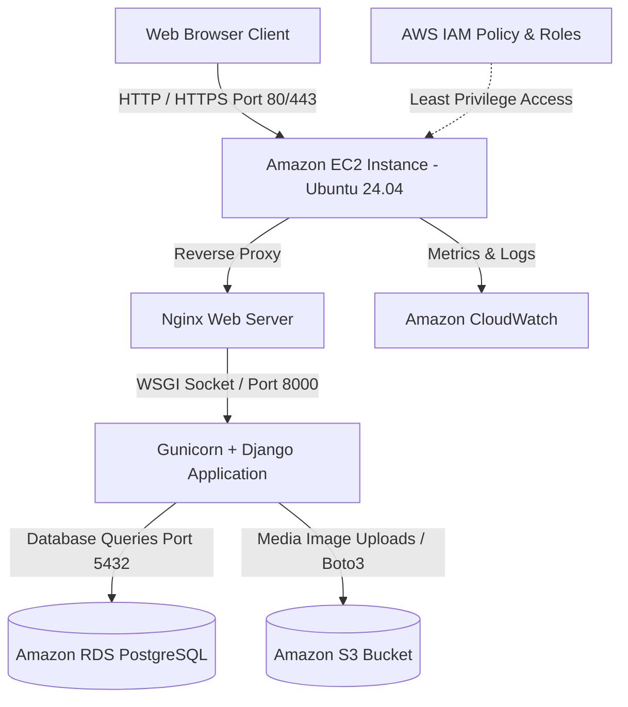

# 🧭 CampusFind: A Cloud-Based Campus Lost & Found System

> **CSBC 252: Introduction to Cloud Computing — Semester Capstone Project**  
> *A production-ready, cloud-native web application built with Django, Bootstrap, and Amazon Web Services (AWS Free Tier: EC2, RDS, S3, IAM, CloudWatch).*

---

## 📚 Capstone Deliverables & Documentation Index

Every component of this project is documented in detail within the [`docs/`](docs/) directory. Use the quick links below to navigate to the respective technical guides and setup sources:

| Deliverable / Section | Description | Source File in `docs/` |
| :--- | :--- | :--- |
| **01. Project Proposal** | Problem statement, objectives, tech stack, and target users | [📑 `docs/01_PROJECT_PROPOSAL.md`](docs/01_PROJECT_PROPOSAL.md) |
| **02. System Architecture & ERD** | Multi-tier cloud architecture, 3NF schema, use cases, and wireframes | [📐 `docs/02_SYSTEM_DESIGN_AND_ARCHITECTURE.md`](docs/02_SYSTEM_DESIGN_AND_ARCHITECTURE.md) |
| **03. AWS Cloud Deployment Guide** | Step-by-step EC2, RDS, S3, IAM, Nginx, and Gunicorn setup guide | [☁️ `docs/03_AWS_DEPLOYMENT_GUIDE.md`](docs/03_AWS_DEPLOYMENT_GUIDE.md) |
| **04. Security & Testing Plan** | Threat mitigation, IAM least privilege, automated test plan, CloudWatch | [🛡️ `docs/04_SECURITY_AND_TESTING_PLAN.md`](docs/04_SECURITY_AND_TESTING_PLAN.md) |
| **05. Video Presentation Script** | 15–20 min speaker script, demo flows, and slide deck outline | [🎙️ `docs/05_VIDEO_PRESENTATION_SCRIPT.md`](docs/05_VIDEO_PRESENTATION_SCRIPT.md) |
| **06. Final Technical Report** | Comprehensive academic report covering lifecycle, design, and results | [📄 `docs/06_FINAL_TECHNICAL_REPORT.md`](docs/06_FINAL_TECHNICAL_REPORT.md) |
| **07. Admin Role & Governance** | Admin portal specifications, audit logs, and data lifecycle | [🔒 `docs/07_ADMIN_ROLE_AND_REQUIREMENTS.md`](docs/07_ADMIN_ROLE_AND_REQUIREMENTS.md) |
| **08. Group Roles & Responsibilities** | Complete team breakdown, 3-day work plan, and action checklist | [👥 `docs/08_GROUP_ROLES_AND_RESPONSIBILITIES.md`](docs/08_GROUP_ROLES_AND_RESPONSIBILITIES.md) |

---

## 🌟 Key Features & Source Modules

- **Centralized Campus Listings:** Public catalog of lost, found, and reunited items across campus buildings. *(See [System Design](docs/02_SYSTEM_DESIGN_AND_ARCHITECTURE.md#3-use-case-specifications))*.
- **Multi-Attribute Search & Filters:** Search by keyword, category, status (Lost/Found/Claimed), campus location, and date. *(Implemented in [`core/views.py`](core/views.py))*.
- **Secure Image Uploads with Amazon S3:** Upload item photos directly to Amazon S3 with automatic local fallback for offline development. *(See [Storage & Security Guide](docs/04_SECURITY_AND_TESTING_PLAN.md#1-cloud-security-architecture))*.
- **Relational Cloud Database with Amazon RDS:** Scalable user profiles and item records hosted on Amazon RDS (PostgreSQL/MySQL). *(See [Database Schema & ERD](docs/02_SYSTEM_DESIGN_AND_ARCHITECTURE.md#1-database-schema--erd))*.
- **Owner & Moderator Dashboards:** Posters can edit, delete, or mark items as Claimed/Reunited; Staff have oversight via custom dashboards. *(See [Project Proposal](docs/01_PROJECT_PROPOSAL.md#4-project-objectives))*.
- **Dedicated Admin Operations Portal (`/ops/`):** Full user governance, role management, audit logging, and soft/hard-delete queues. *(See [Admin Governance Plan](docs/07_ADMIN_ROLE_AND_REQUIREMENTS.md))*.
- **Printable Bulletin Notice Flyers:** One-click printable notice posters with tear-off contact strips for physical campus boards ([`templates/core/print_notice.html`](templates/core/print_notice.html)).
- **Automated Health Monitoring:** `/health/` JSON endpoint designed for AWS EC2, Application Load Balancers, and CloudWatch alarms. *(See [Testing & CloudWatch Plan](docs/04_SECURITY_AND_TESTING_PLAN.md#3-cloudwatch-monitoring-plan))*.

---

## 🏗️ AWS Cloud Architecture

For full architectural diagrams, component interactions, and data flows, refer to **[`docs/02_SYSTEM_DESIGN_AND_ARCHITECTURE.md`](docs/02_SYSTEM_DESIGN_AND_ARCHITECTURE.md)**.



---

## 🚀 Quickstart Guide (Local Development Setup)

For detailed local troubleshooting and setup prerequisites, see **[`docs/03_AWS_DEPLOYMENT_GUIDE.md`](docs/03_AWS_DEPLOYMENT_GUIDE.md#local-development-setup)**.

### 1. Clone & Set Up Virtual Environment
```bash
# Clone the repository
git clone https://github.com/cloudcomputinggroup2/campusfind.git
cd campusfind

# Create and activate Python virtual environment
python3 -m venv venv
source venv/bin/activate   # On Windows: venv\Scripts\activate

# Install dependencies
pip install -r requirements.txt
```

### 2. Configure Environment Variables
Copy the sample environment configuration:
```bash
cp .env.example .env
```
*(By default, [`.env`](.env.example) is configured to use SQLite and local media storage for zero-config offline execution. For production S3/RDS connection parameters, see [AWS Deployment Guide](docs/03_AWS_DEPLOYMENT_GUIDE.md#step-5-configure-environment-variables-on-ec2)).*

### 3. Run Migrations & Seed Demonstration Data
```bash
# Run database migrations
python manage.py migrate

# Collect static files for WhiteNoise
python manage.py collectstatic --noinput

# Populate realistic campus lost/found listings and demo accounts
python manage.py seed_data
```

### 4. Run the Development Server
```bash
python manage.py runserver
```
Visit **[http://127.0.0.1:8000](http://127.0.0.1:8000)** in your browser!

---

## 🔑 Demo Test Accounts

The [`seed_data.py`](core/management/commands/seed_data.py) script initializes the following ready-to-test accounts:

| Role | Username | Password | Access Portals & Permissions |
| :--- | :--- | :--- | :--- |
| **Admin / Operations** | `admin` | `campus2026!` | Dedicated Admin Portal (`/ops/`), Django Admin (`/admin/`), and Moderation (`/moderator/`) |
| **Student User 1** | `student_alex` | `campus2026!` | Standard student reporting, catalog browsing, and item claiming |
| **Student User 2** | `student_maya` | `campus2026!` | Standard student reporting, catalog browsing, and item claiming |
| **Student User 3** | `student_kwame` | `campus2026!` | Standard student reporting, catalog browsing, and item claiming |

---

## 🧪 Running Automated Tests

A comprehensive test suite of **15 automated unit and integration tests** verifies models, permissions, forms, search filters, admin endpoints, and health checks.

To execute the test suite:
```bash
python manage.py test
```

For complete test case descriptions and verification criteria, refer to **[`docs/04_SECURITY_AND_TESTING_PLAN.md`](docs/04_SECURITY_AND_TESTING_PLAN.md#2-automated-test-suite-coretestspy)**.

---

## ☁️ AWS Cloud Deployment (Production)

An automated deployment script and cloud configuration files are provided in the [`deploy/`](deploy/) directory:

- 📜 **EC2 Automated Provisioning Script:** [`deploy/ec2_setup.sh`](deploy/ec2_setup.sh)
- 🌐 **Nginx Web Server Configuration:** [`deploy/nginx.conf`](deploy/nginx.conf)
- ⚙️ **Gunicorn Systemd Service:** [`deploy/gunicorn.service`](deploy/gunicorn.service)
- 🔒 **S3 Least-Privilege IAM Policy:** [`deploy/iam_policy.json`](deploy/iam_policy.json)

### Deployment Steps Summary:
1. **Compute (EC2):** Launch an Ubuntu 24.04 `t2.micro` EC2 instance with Security Group allowing ports `22`, `80`, and `443`.
2. **Database (RDS):** Launch an Amazon RDS PostgreSQL instance with Security Group allowing port `5432` from the EC2 Security Group.
3. **Storage (S3 & IAM):** Create an S3 bucket (`campusfind-item-images-capstone`) and configure IAM credentials from [`deploy/iam_policy.json`](deploy/iam_policy.json).
4. **Automated Setup:** SSH into EC2 and run:
   ```bash
   git clone https://github.com/cloudcomputinggroup2/campusfind.git /home/ubuntu/campusfind
   cd /home/ubuntu/campusfind
   chmod +x deploy/ec2_setup.sh
   ./deploy/ec2_setup.sh
   ```
5. Update `/home/ubuntu/campusfind/.env` with your Amazon RDS and S3 credentials, then restart services:
   ```bash
   sudo systemctl restart gunicorn
   sudo systemctl restart nginx
   ```

For comprehensive step-by-step AWS provisioning instructions with screenshots, refer to **[`docs/03_AWS_DEPLOYMENT_GUIDE.md`](docs/03_AWS_DEPLOYMENT_GUIDE.md)**.

---

## 📂 Project Directory Structure

```text
capstone/
├── campusfind/                # Django project root configuration
│   ├── settings.py            # S3, RDS, WhiteNoise, Auth settings
│   ├── urls.py                # Main URL routing & admin branding
│   ├── wsgi.py / asgi.py      # WSGI / ASGI entrypoints
├── core/                      # Main campus application
│   ├── models.py              # Item, AuditLog, SecurityAlert models
│   ├── forms.py               # ItemForm, RegistrationForm, validation
│   ├── views.py               # CRUD views, search, stats, health check
│   ├── admin_portal_views.py  # Admin Operations Portal views (/ops/)
│   ├── urls.py                # App routing
│   ├── admin.py               # Customized Django Admin interface
│   ├── tests.py               # 15 Automated unit and integration tests
│   ├── context_processors.py  # Global stats and metadata
│   └── management/commands/
│       └── seed_data.py       # Realistic demo data populator
├── templates/                 # Modern responsive HTML5 templates
│   ├── base.html              # Layout, navbar, footer, messages
│   ├── core/                  # Student & Moderator templates
│   │   ├── home.html          # Hero search, live stats, recent cards
│   │   ├── item_list.html     # Search & filter directory (Grid/Table)
│   │   ├── item_detail.html   # Full item view, contact card, photo modal
│   │   ├── item_form.html     # Report / Edit form with live preview
│   │   ├── item_confirm_delete.html
│   │   ├── my_posts.html      # User's personal dashboard
│   │   ├── moderator_dashboard.html # Staff moderation portal
│   │   ├── print_notice.html  # Printable notice flyer with tear-off slips
│   │   ├── login.html         # User login with demo credentials helper
│   │   └── register.html      # Student registration
│   └── admin_portal/          # Dedicated Admin Operations Portal (/ops/)
│       ├── base_admin.html    # Operations layout with sidebar
│       ├── dashboard.html     # Security, health & governance dashboard
│       ├── users.html         # User account governance & access control
│       ├── user_detail.html   # Profile inspection & mandatory reason modals
│       ├── roles.html         # Role hierarchy & capability bundles
│       ├── audit_logs.html    # Immutable audit trail & CSV export
│       ├── data_operations.html # Soft-delete queue & permanent purge
│       ├── system_settings.html # Platform policies & parameters
│       └── security_alerts.html # Incident triage & resolution
├── static/                    # Custom design system
│   ├── css/styles.css         # Modern color tokens, card layouts
│   ├── css/admin_custom.css   # Operations portal styling
│   └── js/main.js             # Image preview, copy to clipboard, alerts
├── deploy/                    # AWS Cloud deployment assets
│   ├── ec2_setup.sh           # Automated EC2 provisioning script
│   ├── nginx.conf             # Nginx reverse proxy configuration
│   ├── gunicorn.service       # Systemd daemon service definition
│   └── iam_policy.json        # S3 least-privilege IAM policy
├── docs/                      # Capstone Deliverables & Documentation Suite
│   ├── 01_PROJECT_PROPOSAL.md
│   ├── 02_SYSTEM_DESIGN_AND_ARCHITECTURE.md
│   ├── 03_AWS_DEPLOYMENT_GUIDE.md
│   ├── 04_SECURITY_AND_TESTING_PLAN.md
│   ├── 05_VIDEO_PRESENTATION_SCRIPT.md
│   ├── 06_FINAL_TECHNICAL_REPORT.md
│   ├── 07_ADMIN_ROLE_AND_REQUIREMENTS.md
│   └── 08_GROUP_ROLES_AND_RESPONSIBILITIES.md
├── Dockerfile & docker-compose.yml # Containerized execution
├── requirements.txt           # Project dependencies
├── .env.example               # Configuration template
└── README.md                  # Project overview and documentation index
```

---

## 👥 Group Roles & Presentation Guide

To review the detailed matrix of student roles, 3-day work plan, and presentation script:
- 👥 **Group Roles & Responsibilities:** [docs/08_GROUP_ROLES_AND_RESPONSIBILITIES.md](docs/08_GROUP_ROLES_AND_RESPONSIBILITIES.md)
- 🎙️ **15–20 Min Video Presentation Script:** [docs/05_VIDEO_PRESENTATION_SCRIPT.md](docs/05_VIDEO_PRESENTATION_SCRIPT.md)

---

Developed for **CSBC 252: Introduction to Cloud Computing** Capstone Project.
