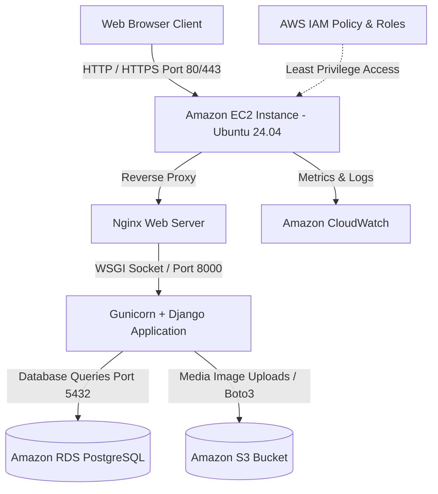

# Capstone Deliverable 1: Project Proposal

## 1. Project Information
- **Project Title:** CampusFind: A Cloud-Based Campus Lost & Found System
- **Course:** CSBC 252 - Introduction to Cloud Computing
- **Project Type:** AWS Free Tier Cloud Web Application (3-Day Build)
- **Target Platform:** Web (Desktop, Tablet, Mobile Responsive)

---

## 2. Team Member Roles & Responsibilities

| Role | Primary Responsibilities | Deliverables |
| :--- | :--- | :--- |
| **Frontend Developer** | Bootstrap 5 templates, responsive layouts, search UI, item detail cards, print flyer views | HTML templates, `styles.css`, `main.js`, UI styling |
| **Backend Developer** | Django models, views, forms, authentication, CRUD logic, health check endpoints | `models.py`, `views.py`, `forms.py`, `urls.py` |
| **Cloud Architect** | EC2 provisioning, Security Groups configuration, Nginx reverse proxy, Gunicorn WSGI | `ec2_setup.sh`, `nginx.conf`, `gunicorn.service` |
| **Database Lead** | Amazon RDS PostgreSQL setup, ERD schema design, Django migrations, data seeding | RDS DB configuration, `seed_data.py`, migrations |
| **Storage & Security Lead** | Amazon S3 bucket setup, IAM least-privilege policies, file validation, `.env` config | `iam_policy.json`, S3 settings, security checks |
| **QA & Documentation Lead** | Automated testing, documentation, CloudWatch metrics capture, presentation script | `tests.py`, technical reports, presentation guide |

---

## 3. Problem Statement
Students, faculty, and campus staff frequently misplace critical belongings such as student ID cards, keys, laptops, chargers, textbooks, backpacks, and personal items across large university campuses.

Currently, lost and found reports in many institutions are fragmented across informal channels such as:
- Unorganized WhatsApp or Telegram group chats
- Physical notice boards scattered across campus
- Word of mouth or informal campus security inquiries

This informal approach makes it exceptionally difficult to:
1. Search and filter lost or found items in real time.
2. Verify legitimate ownership before items are returned.
3. Track whether an item has already been claimed or is still missing.

---

## 4. Project Objectives
1. **Centralized Digital Platform:** Provide a single cloud-hosted repository for all campus lost and found listings.
2. **Comprehensive CRUD Operations:** Allow authenticated users to create, view, search, edit, and delete their lost/found postings.
3. **Cloud Storage Separation:** Store uploaded item photos securely in Amazon S3 rather than local EC2 disk storage.
4. **Relational Cloud Database:** Manage user accounts and item records using Amazon RDS (PostgreSQL/MySQL).
5. **Least-Privilege Security & Governance:** Implement IAM policies, security groups, environment variables (`.env`), and Django authentication.
6. **Cloud Monitoring:** Utilize Amazon CloudWatch for EC2 server metrics and health monitoring.

---

## 5. Proposed Solution & Architecture
CampusFind is a cloud-native web application built using **Django 5** and **Bootstrap 5**, deployed on **Amazon EC2 (Ubuntu Linux)** with a reverse proxy via **Nginx** and **Gunicorn**. 

Structured relational data is persisted in **Amazon RDS**, while media assets (photographs of lost/found items) are uploaded directly to an **Amazon S3** bucket. Access control and perimeter protection are enforced through AWS **Security Groups** and **IAM Roles**.

---

## 6. Technology Stack

- **Backend Framework:** Python 3.12+ / Django 5.0+
- **Frontend UI:** HTML5, CSS3, JavaScript, Bootstrap 5.3, Bootstrap Icons
- **Web / WSGI Server:** Nginx + Gunicorn
- **Cloud Hosting:** Amazon Web Services (AWS Free Tier)
  - **Compute:** Amazon EC2 (t2.micro / t3.micro)
  - **Database:** Amazon RDS (PostgreSQL / MySQL)
  - **Object Storage:** Amazon S3 (Item Photos)
  - **Access Management:** AWS IAM
  - **Monitoring:** Amazon CloudWatch
