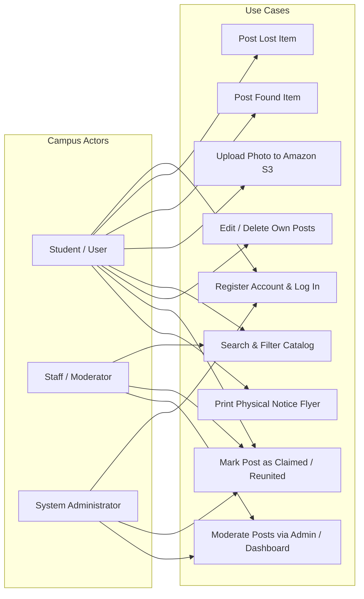
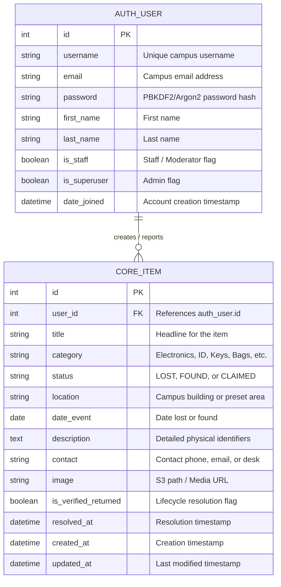
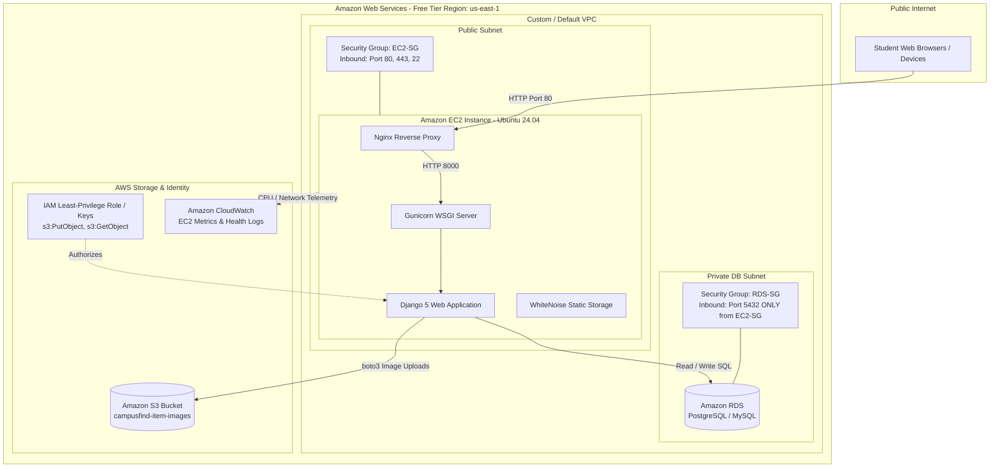

# Capstone Deliverable 2: System Design & Architecture Document

## 1. System Overview & Use Cases

CampusFind is structured around distinct user roles: **Student / General User**, **Campus Moderator / Staff**, and **System Administrator**.

### Key Use Cases:
1. **User Account Management:** Students create accounts with university credentials, login securely with hashed passwords, and view their dashboard.
2. **Item Reporting:** Users submit details for items lost or found, with category tagging, location selection, and optional image upload.
3. **Multi-Attribute Search & Discovery:** Users search by keyword, category, status (`Lost`, `Found`, `Claimed`), and campus building.
4. **Ownership & Lifecycle Verification:** Posters or staff mark items as `Claimed / Reunited` once returned to the rightful owner.
5. **Physical Campus Notice Generation:** Users can generate printable flyers with tear-off contact slips for physical bulletin boards.

---

## 2. Database Design & Entity Relationship Diagram (ERD)

The relational schema is implemented via the Django ORM and hosted on **Amazon RDS**.

### Table Specifications:
1. **`auth_user` Table:**
   - `id` (Primary Key, Integer)
   - `username` (VARCHAR(150), Unique)
   - `email` (VARCHAR(254), Indexed)
   - `password` (VARCHAR(128), Django PBKDF2 SHA-256 Hash)
   - `is_staff` / `is_superuser` (BOOLEAN)
   - `date_joined` (DATETIME)
2. **`core_item` Table:**
   - `id` (Primary Key, Integer)
   - `user_id` (Foreign Key -> `auth_user.id`, CASCADE on delete)
   - `title` (VARCHAR(200))
   - `category` (VARCHAR(50))
   - `status` (VARCHAR(20), Indexed)
   - `location` (VARCHAR(200))
   - `date_event` (DATE)
   - `description` (TEXT)
   - `contact` (VARCHAR(255))
   - `image` (VARCHAR(100), Stores Amazon S3 file key)
   - `is_verified_returned` (BOOLEAN, default False)
   - `resolved_at` (DATETIME, Nullable)
   - `created_at` / `updated_at` (DATETIME)

---

## 3. AWS Cloud Architecture Diagram

### AWS Cloud Architecture Component Matrix:

| Layer | Component | AWS Service | Purpose & Configuration |
| :--- | :--- | :--- | :--- |
| **Presentation** | Web UI & Static Files | Nginx + WhiteNoise | Serves compressed CSS, JS, and HTML templates over HTTP/HTTPS |
| **Application** | Web Framework | Amazon EC2 (Ubuntu 24.04) | Hosts Django core logic, authentication, CRUD, and pagination |
| **Database** | Relational Data | Amazon RDS (PostgreSQL/MySQL) | Stores `auth_user` accounts and `core_item` records |
| **Object Storage** | Media Assets | Amazon S3 | Secure bucket for uploaded photos of lost/found items |
| **Security** | IAM & Security Groups | AWS IAM + EC2/RDS SGs | Restricts RDS inbound access strictly to EC2 SG; least privilege S3 policy |
| **Monitoring** | Observability | Amazon CloudWatch | Captures EC2 CPU utilization, network I/O, and health check alerts |
