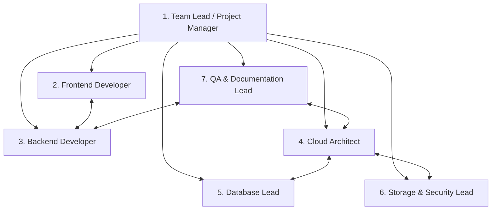

# 👥 CampusFind: Capstone Group Roles & Responsibilities Guide

**Course:** CSBC 252 - Introduction to Cloud Computing  
**Project:** CampusFind: A Cloud-Based Campus Lost & Found System  
**Document:** Group Roles & Responsibilities Matrix  

---

## 📌 Executive Summary

This document provides a clear, comprehensive breakdown of all student roles for the **CampusFind** capstone project. It outlines the specific technical responsibilities, key file deliverables, AWS cloud tasks, presentation speaking parts, and day-by-day action items for each team member.

---

## 🧭 Team Role Summary Matrix

| Role | Primary Domain | Core AWS / Tech Stack | Primary File Deliverables | Presentation Section |
| :--- | :--- | :--- | :--- | :--- |
| **1. Team Lead / Project Manager** | Project coordination, timeline, overall architecture & proposal | AWS Overview, GitHub, Trello/Jira | [`docs/01_PROJECT_PROPOSAL.md`](file:///home/oxcyron/Desktop/capstone/docs/01_PROJECT_PROPOSAL.md), [`README.md`](file:///home/oxcyron/Desktop/capstone/README.md) | Section 1: Intro & Problem Statement (0:00–2:30) |
| **2. Frontend Developer / UI Lead** | UI/UX design, responsive layouts, Bootstrap templates, JS | HTML5, Bootstrap 5.3, CSS3, Vanilla JS | [`templates/`](file:///home/oxcyron/Desktop/capstone/templates), [`static/css/styles.css`](file:///home/oxcyron/Desktop/capstone/static/css/styles.css), [`static/js/main.js`](file:///home/oxcyron/Desktop/capstone/static/js/main.js) | Section 2: Live Platform Demo (2:30–7:30) |
| **3. Backend Developer** | Core business logic, CRUD endpoints, search filters, auth | Python 3.12, Django 5.0, Django Auth | [`core/models.py`](file:///home/oxcyron/Desktop/capstone/core/models.py), [`core/views.py`](file:///home/oxcyron/Desktop/capstone/core/views.py), [`core/forms.py`](file:///home/oxcyron/Desktop/capstone/core/forms.py) | Section 2 / 3: Application Logic (with Frontend) |
| **4. Cloud Architect / DevOps Lead** | EC2 provisioning, Nginx proxy, Gunicorn WSGI, networking | Amazon EC2 (Ubuntu 24.04), Nginx, Gunicorn | [`deploy/ec2_setup.sh`](file:///home/oxcyron/Desktop/capstone/deploy/ec2_setup.sh), [`deploy/nginx.conf`](file:///home/oxcyron/Desktop/capstone/deploy/nginx.conf), [`deploy/gunicorn.service`](file:///home/oxcyron/Desktop/capstone/deploy/gunicorn.service) | Section 3: AWS Architecture & Compute (7:30–10:30) |
| **5. Database Lead** | Schema normalization (3NF), RDS provisioning, migrations | Amazon RDS PostgreSQL / MySQL, Django ORM | [`core/management/commands/seed_data.py`](file:///home/oxcyron/Desktop/capstone/core/management/commands/seed_data.py), [`campusfind/settings.py`](file:///home/oxcyron/Desktop/capstone/campusfind/settings.py) | Section 4: Database & RDS Integration (10:30–12:30) |
| **6. Storage & Security Lead** | S3 object storage, IAM least privilege, environment secrets | Amazon S3, AWS IAM, `django-storages`, `boto3` | [`deploy/iam_policy.json`](file:///home/oxcyron/Desktop/capstone/deploy/iam_policy.json), [`.env.example`](file:///home/oxcyron/Desktop/capstone/.env.example) | Section 5: Security, S3 & IAM (12:30–15:00) |
| **7. QA & Documentation Lead** | Automated tests, CloudWatch monitoring, final reports | Django Test Runner, Amazon CloudWatch | [`core/tests.py`](file:///home/oxcyron/Desktop/capstone/core/tests.py), [`docs/06_FINAL_TECHNICAL_REPORT.md`](file:///home/oxcyron/Desktop/capstone/docs/06_FINAL_TECHNICAL_REPORT.md) | Section 6: Testing, CloudWatch & Conclusion (15:00–18:00) |

---

## 🔍 Detailed Role Breakdown

---

### 👑 1. Team Lead / Project Manager

#### What You Are Supposed to Do:
- **Project Governance:** Lead the group, ensure all 3-day milestone deadlines are met, and coordinate task handoffs between frontend, backend, cloud, and database leads.
- **Scope Control:** Enforce project scope boundaries (ensuring no unnecessary complex features like peer chat or payment gateways derail the project).
- **Proposal & Slides Coordination:** Finalize the project proposal document, organize group meetings, and prepare the slide deck template for the video presentation.

#### Key Deliverables:
- [`docs/01_PROJECT_PROPOSAL.md`](file:///home/oxcyron/Desktop/capstone/docs/01_PROJECT_PROPOSAL.md)
- GitHub repository management, pull request reviews, and commit hygiene.
- Final presentation slide deck assembly.

#### Video Presentation Task (Allocated Time: 0:00 – 2:30):
- Deliver **Section 1: Introduction & Problem Statement**.
- Introduce the team members and state the project title.
- Explain the real-world campus problem (lost IDs, phones, books, lack of central search).
- Outline the project objectives and give a high-level overview of the AWS solution.

---

### 🎨 2. Frontend Developer / UI Lead

#### What You Are Supposed to Do:
- **Responsive User Interface:** Build and polish all responsive HTML5 templates using Bootstrap 5.3 and custom CSS.
- **Component Design:** Build modern navigation bars, category chips, hero search banners, lost/found status badges, item card grids, and table directory views.
- **Printable Notice Flyer:** Implement the print-optimized view with tear-off contact slips for physical campus notice boards ([`templates/core/print_notice.html`](file:///home/oxcyron/Desktop/capstone/templates/core/print_notice.html)).
- **Client-Side Dynamics (`main.js`):** Implement client-side photo upload preview, one-click contact copying to clipboard, and responsive toast alerts.

#### Key Deliverables:
- All template files under [`templates/`](file:///home/oxcyron/Desktop/capstone/templates): `base.html`, `home.html`, `item_list.html`, `item_detail.html`, `item_form.html`, `my_posts.html`, `moderator_dashboard.html`, `print_notice.html`.
- Custom CSS design system: [`static/css/styles.css`](file:///home/oxcyron/Desktop/capstone/static/css/styles.css).
- Interactive JavaScript: [`static/js/main.js`](file:///home/oxcyron/Desktop/capstone/static/js/main.js).

#### Video Presentation Task (Allocated Time: 2:30 – 7:30):
- Deliver **Section 2: Live Demonstration of Web Application**.
- Screen share the live web app in the browser:
  1. Showcase the homepage metrics and search bar.
  2. Log in as a student (`student_alex`).
  3. Submit a new lost/found item with photo upload preview.
  4. Demonstrate search, filtering (category/status), and switching between Grid & Table views.
  5. Demonstrate the **Print Notice Flyer** view with tear-off contact slips.
  6. Demonstrate **My Posts** dashboard and marking an item as Claimed/Reunited.

---

### ⚙️ 3. Backend Developer / Application Engineer

#### What You Are Supposed to Do:
- **Data Models & Business Logic:** Maintain the `Item` model, validation rules, category/location choices, and lifecycle methods (`mark_as_claimed`, `reopen`, `soft_delete`, `restore`).
- **Form Validation & Security:** Handle Django forms (`ItemForm`, `UserRegistrationForm`) with strict file upload checks (5MB limit, valid image formats).
- **CRUD Views & Routing:** Implement and maintain catalog views, search query filtering, owner authorization gates, and the staff moderation dashboard.
- **Admin Operations Hub:** Support the dedicated `/ops/` portal for administrative user governance, role management, and audit logging.

#### Key Deliverables:
- [`core/models.py`](file:///home/oxcyron/Desktop/capstone/core/models.py)
- [`core/views.py`](file:///home/oxcyron/Desktop/capstone/core/views.py) & [`core/admin_portal_views.py`](file:///home/oxcyron/Desktop/capstone/core/admin_portal_views.py)
- [`core/forms.py`](file:///home/oxcyron/Desktop/capstone/core/forms.py)
- [`core/urls.py`](file:///home/oxcyron/Desktop/capstone/core/urls.py) & [`core/context_processors.py`](file:///home/oxcyron/Desktop/capstone/core/context_processors.py)

#### Video Presentation Task (Collaborate with Frontend in Section 2):
- Explain backend routing, ownership access control (users can only edit/delete their own posts), and moderation workflows.

---

### ☁️ 4. Cloud Architect / DevOps Lead

#### What You Are Supposed to Do:
- **EC2 Instance Provisioning:** Launch and configure an Amazon EC2 instance (Ubuntu 24.04 LTS, `t2.micro` Free Tier).
- **Web Server & Reverse Proxy:** Configure Nginx to serve static assets via WhiteNoise/Nginx caching and reverse proxy dynamic requests to Gunicorn on socket/port 8000.
- **Daemon Management:** Set up Gunicorn as a resilient `systemd` background service (`gunicorn.service`) with auto-restart on server reboot.
- **Security Groups (EC2):** Create `CampusFind-EC2-SG` allowing inbound HTTP (Port 80), HTTPS (Port 443), and restricted SSH (Port 22).

#### Key Deliverables:
- [`deploy/ec2_setup.sh`](file:///home/oxcyron/Desktop/capstone/deploy/ec2_setup.sh) (Automated provisioning script)
- [`deploy/nginx.conf`](file:///home/oxcyron/Desktop/capstone/deploy/nginx.conf)
- [`deploy/gunicorn.service`](file:///home/oxcyron/Desktop/capstone/deploy/gunicorn.service)
- [`docs/02_SYSTEM_DESIGN_AND_ARCHITECTURE.md`](file:///home/oxcyron/Desktop/capstone/docs/02_SYSTEM_DESIGN_AND_ARCHITECTURE.md) & [`docs/03_AWS_DEPLOYMENT_GUIDE.md`](file:///home/oxcyron/Desktop/capstone/docs/03_AWS_DEPLOYMENT_GUIDE.md)

#### Video Presentation Task (Allocated Time: 7:30 – 10:30):
- Deliver **Section 3: AWS Cloud Architecture & Infrastructure**.
- Present the AWS Architecture Diagram.
- Screen share the EC2 AWS Console and SSH terminal.
- Explain Nginx reverse proxying, Gunicorn WSGI workers, and Security Group configurations.

---

### 🗄️ 5. Database Lead / Data Engineer

#### What You Are Supposed to Do:
- **Amazon RDS Setup:** Launch an Amazon RDS PostgreSQL (or MySQL) instance in a private DB subnet group.
- **Network Isolation:** Configure `CampusFind-RDS-SG` to accept incoming PostgreSQL connections on Port 5432 **only** from `CampusFind-EC2-SG`.
- **Database Normalization & Migrations:** Ensure the schema adheres to Third Normal Form (3NF), run initial Django migrations, and index performance-critical columns (`status`, `category`, `created_at`).
- **Data Seeding Script:** Maintain [`seed_data.py`](file:///home/oxcyron/Desktop/capstone/core/management/commands/seed_data.py) to generate realistic demo accounts, categories, and lost/found item entries.

#### Key Deliverables:
- RDS instance configuration and database environment parameters.
- [`core/management/commands/seed_data.py`](file:///home/oxcyron/Desktop/capstone/core/management/commands/seed_data.py)
- ERD schema diagrams and database documentation in [`docs/02_SYSTEM_DESIGN_AND_ARCHITECTURE.md`](file:///home/oxcyron/Desktop/capstone/docs/02_SYSTEM_DESIGN_AND_ARCHITECTURE.md).

#### Video Presentation Task (Allocated Time: 10:30 – 12:30):
- Deliver **Section 4: Database Schema & RDS Integration**.
- Present the Entity Relationship Diagram (ERD).
- Screen share the Amazon RDS Console showing the active DB instance and private security group.
- Explain table relationships (`auth_user` 1-to-many `core_item`), indexing, and data seeding.

---

### 🔐 6. Storage & Security Lead

#### What You Are Supposed to Do:
- **Amazon S3 Bucket Provisioning:** Create a dedicated S3 bucket (`campusfind-item-images-capstone`) for uploaded item photographs.
- **Decoupled Media Storage:** Configure `django-storages` and `boto3` so uploads go directly to S3, with automatic fallback to local media storage for offline development.
- **Least-Privilege IAM Policy:** Create a restricted IAM user/policy granting only `s3:PutObject`, `s3:GetObject`, `s3:DeleteObject`, and `s3:ListBucket` on the specific bucket ARN.
- **Secrets Management:** Ensure zero sensitive keys or passwords exist in source code by enforcing runtime configuration via [`.env`](file:///home/oxcyron/Desktop/capstone/.env).

#### Key Deliverables:
- [`deploy/iam_policy.json`](file:///home/oxcyron/Desktop/capstone/deploy/iam_policy.json)
- S3 configuration in [`campusfind/settings.py`](file:///home/oxcyron/Desktop/capstone/campusfind/settings.py)
- [`.env.example`](file:///home/oxcyron/Desktop/capstone/.env.example) configuration template
- [`docs/04_SECURITY_AND_TESTING_PLAN.md`](file:///home/oxcyron/Desktop/capstone/docs/04_SECURITY_AND_TESTING_PLAN.md) (Security sections)

#### Video Presentation Task (Allocated Time: 12:30 – 15:00):
- Deliver **Section 5: Security, S3 Image Storage & IAM**.
- Screen share the Amazon S3 Console showing uploaded image objects.
- Screen share the IAM Console displaying the least-privilege JSON policy.
- Explain environment variable secrets separation, CSRF/XSS protection, and password hashing.

---

### 🧪 7. QA, Testing & Documentation Lead

#### What You Are Supposed to Do:
- **Automated Test Suite:** Maintain and run all 15 automated Django unit & integration tests covering models, CRUD, forms, permissions, search filters, admin portal, and health checks.
- **Cloud Monitoring & Health Checks:** Verify the `/health/` endpoint and capture Amazon CloudWatch metrics (EC2 CPU Utilization, Network In/Out).
- **Technical Report Compilation:** Finalize the comprehensive Technical Report ([`docs/06_FINAL_TECHNICAL_REPORT.md`](file:///home/oxcyron/Desktop/capstone/docs/06_FINAL_TECHNICAL_REPORT.md)).
- **Video Script & Timing:** Manage the presentation rehearsal, speaker transitions, and ensure the video stays within the 15–20 minute requirement.

#### Key Deliverables:
- [`core/tests.py`](file:///home/oxcyron/Desktop/capstone/core/tests.py) (All 15 passing automated tests)
- [`docs/04_SECURITY_AND_TESTING_PLAN.md`](file:///home/oxcyron/Desktop/capstone/docs/04_SECURITY_AND_TESTING_PLAN.md)
- [`docs/05_VIDEO_PRESENTATION_SCRIPT.md`](file:///home/oxcyron/Desktop/capstone/docs/05_VIDEO_PRESENTATION_SCRIPT.md)
- [`docs/06_FINAL_TECHNICAL_REPORT.md`](file:///home/oxcyron/Desktop/capstone/docs/06_FINAL_TECHNICAL_REPORT.md)

#### Video Presentation Task (Allocated Time: 15:00 – 18:00):
- Deliver **Section 6: Testing, CloudWatch & Conclusion**.
- Screen share the terminal showing `./venv/bin/python manage.py test` passing 15/15 tests.
- Screen share the `/health/` JSON response and CloudWatch metrics graphs.
- Summarize challenges overcome, lessons learned, and future enhancements (QR code scanning, email matching alerts).

---

## 📅 3-Day Action Plan by Role

| Day | Team Lead & PM | Frontend & Backend | Cloud Architect | Database Lead | Storage & Security | QA & Docs |
| :--- | :--- | :--- | :--- | :--- | :--- | :--- |
| **Day 1: Core Build** | Align requirements, project proposal, GitHub repo setup | Implement models, views, templates, CRUD, auth | Set up local venv, create Nginx/Gunicorn configs | Design schema, write `seed_data.py`, test migrations | Configure `.env.example`, image validation | Write initial unit tests for CRUD and auth |
| **Day 2: AWS Services** | Review milestone progress, unblock dependencies | Refine search UI, moderator view, print flyer | Launch EC2, configure Security Groups, run setup script | Launch RDS DB, connect EC2, verify remote queries | Create S3 bucket, configure IAM policy & `boto3` | Write integration tests, test `/health/` endpoint |
| **Day 3: Polish & Deliver** | Finalize slide deck, coordinate video recording | UI polish, responsive testing, accessibility check | Verify EC2 public URL, check Nginx logs | Verify RDS backups and indexes | Verify S3 image URLs and IAM least privilege | Capture CloudWatch graphs, assemble final report, record video |

---

## 🎯 Quick Verification Checklist Before Submission

- [ ] **Codebase:** All 15 automated tests pass (`./venv/bin/python manage.py test`).
- [ ] **Local Demo Data:** `python manage.py seed_data` populates realistic items and test accounts.
- [ ] **GitHub Repository:** Code pushed with clean commit history and no exposed secrets in `.env`.
- [ ] **AWS Resources (if live):** EC2 running, RDS connected, S3 storing uploads, IAM least privilege enforced.
- [ ] **Proof Portfolio:** Screenshots taken of EC2, RDS, S3, IAM, CloudWatch, and public website.
- [ ] **Documentation Suite:** All 8 markdown files in [`docs/`](file:///home/oxcyron/Desktop/capstone/docs) verified and complete.
- [ ] **Presentation Video:** 15–20 minute recording completed with all team members speaking.
